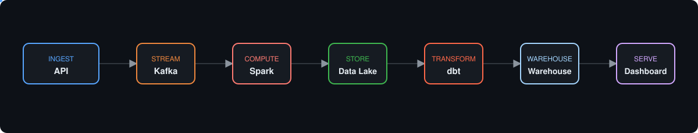
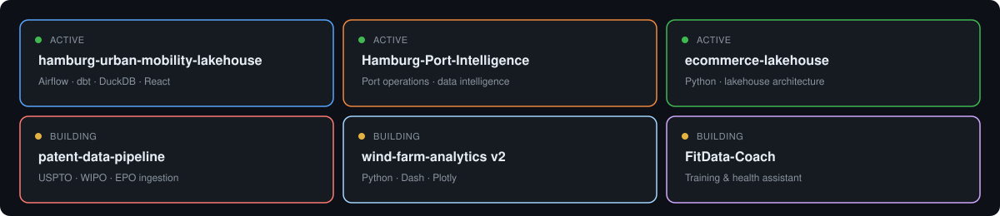
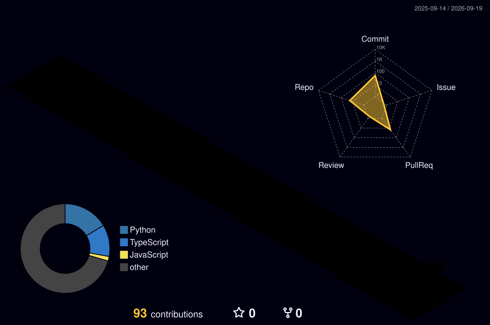
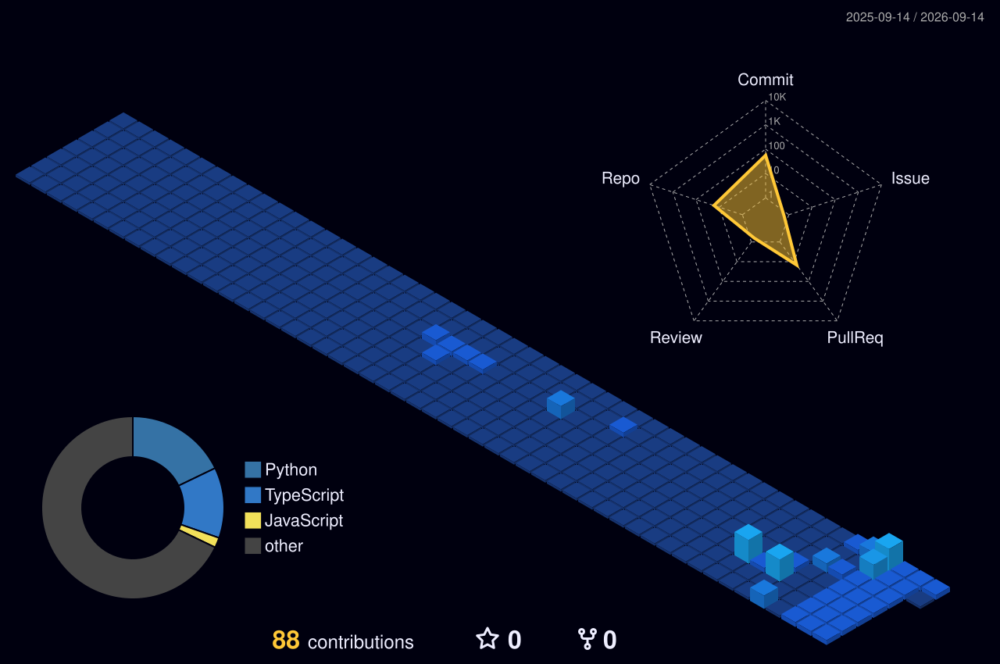
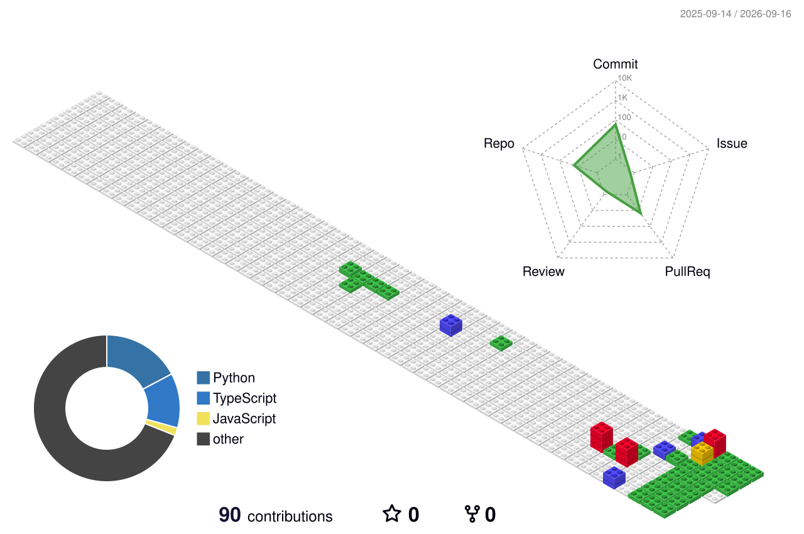
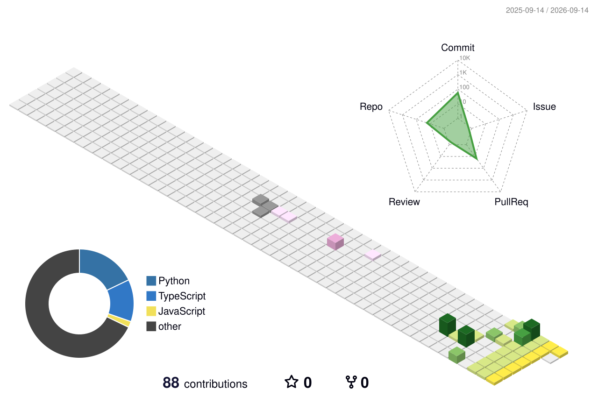
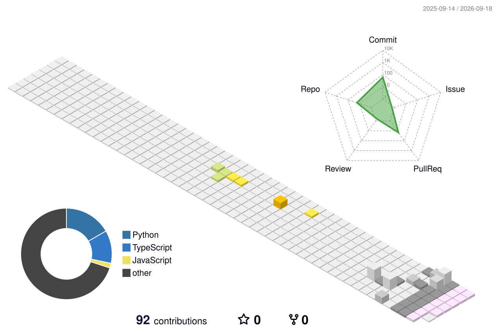
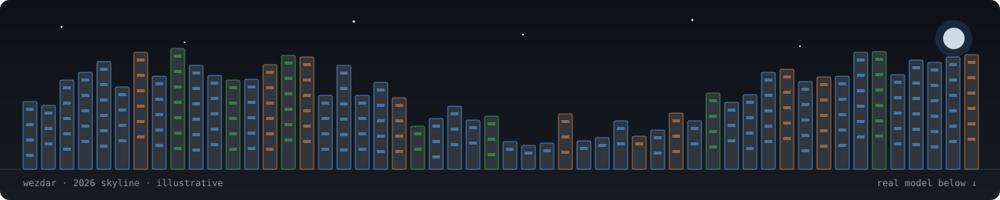

<a href="https://github.com/wezdar">
  
</a>

<p align="center">
  <a href="https://github.com/wezdar"></a>
  <a href="https://github.com/wezdar?tab=followers"></a>
  <a href="https://github.com/wezdar"></a>
</p>

<div align="center">
  <a href="https://github.com/wezdar">
    
  </a>
</div>

<div align="center">
  
</div>

<h2 id="about" align="center">💻 About Me</h2>

```python
class AhmedWezdar:
    """Data Engineer building pipelines and lakehouses from real-world open data."""

    location        = "🇩🇪 Germany — open to remote"
    languages        = ["Python", "SQL", "TypeScript"]
    core_stack       = ["Airflow", "Spark", "Kafka", "dbt", "DuckDB", "Parquet"]
    cloud            = ["Azure", "AWS", "Docker", "Terraform"]
    currently_into   = ["Urban mobility data", "Lakehouse architecture", "Patent data pipelines"]
    speaks           = ["English", "Français", "Deutsch"]

    def philosophy(self) -> str:
        return "Raw data in, trustworthy tables out."

    def __repr__(self) -> str:
        return f"<{type(self).__name__} based_in={self.location!r}>"


me = AhmedWezdar()
print(me.philosophy())  # → Raw data in, trustworthy tables out.
```

<div align="center">
  
</div>

<div align="center">
  
</div>

<p align="center">
  <a href="#skills">Tech Stack</a> •
  <a href="#pipeline">Data Pipeline</a> •
  <a href="#focus">Current Focus</a> •
  <a href="#stats">GitHub Stats</a> •
  <a href="#activity">Recent Activity</a> •
  <a href="#projects">Featured Projects</a> •
  <a href="#pins">Pinned Repos</a> •
  <a href="#contributions">Contributions</a> •
  <a href="#connect">Connect</a>
</p>

<div align="center">
  
  
  
</div>

<h2 id="skills" align="center">🧰 Tech Stack</h2>

<p align="center">
  <a href="https://github.com/wezdar">
    
  </a>
</p>

<p align="center"><sub><i>Skillicons.dev doesn't carry the data-engineering-specific tools (Airflow, Spark, Kafka, dbt, Parquet…) — those are below.</i></sub></p>

<table align="center" width="100%">
<tr>
<td align="center" width="50%" valign="top">
<h4>🔄 Orchestration &amp; Streaming</h4>
<p>


</p>
</td>
<td align="center" width="50%" valign="top">
<h4>🏗️ Transform &amp; Storage</h4>
<p>


</p>
</td>
</tr>
<tr>
<td align="center" width="50%" valign="top">
<h4>☁️ Cloud &amp; Infra</h4>
<p>


</p>
</td>
<td align="center" width="50%" valign="top">
<h4>📊 Analytics &amp; Viz</h4>
<p>


</p>
</td>
</tr>
</table>

<div align="center">
  
  
  
</div>

<h2 id="pipeline" align="center">⚙️ How I Move Data</h2>

<div align="center">
  
</div>

<div align="center">
  
  
  
</div>

<h2 id="focus" align="center">🎯 Current Focus</h2>

<p align="center">
  
</p>

<div align="center">
  
  
  
</div>

<h2 id="stats" align="center">📊 GitHub Stats</h2>

<div align="center">
  
</div>

<div align="center">
  
  
</div>

<div align="center">
  
  
</div>

<div align="center">
  
  
  
</div>

<h2 id="activity" align="center">⚡ Recent Activity</h2>

<!--START_SECTION:activity-->
<!-- populated automatically by .github/workflows/activity.yml once this repo is live on GitHub -->
<!--END_SECTION:activity-->

<div align="center">
  
  
  
</div>

<h2 id="projects" align="center">🏗️ Featured Projects</h2>

<table width="100%">
  <tr>
    <td valign="top" width="50%">
      <h3>🚴 Hamburg Urban Mobility Lakehouse</h3>
      <p>
        <b>Problem.</b> Hamburg's open mobility data — bikes, traffic, EV charging, signals — is scattered across dozens of public feeds.<br/>
        <b>Approach.</b> Multimodal ingestion pipeline consolidating 84,000+ data streams into one lakehouse.<br/>
        <b>Stack.</b> <code>Python · Airflow · dbt · DuckDB · Parquet · React</code><br/>
        <b>Outcome.</b> Working dashboard analyzing bikes, traffic, EV charging stations, and traffic signals citywide.
      </p>
      <p><a href="https://github.com/wezdar/hamburg-urban-mobility-lakehouse"></a></p>
    </td>
    <td valign="top" width="50%">
      <h3>💨 Wind Farm Analytics v2</h3>
      <p>
        <b>Problem.</b> Wind resource data across German cities needed a single place to explore and compare.<br/>
        <b>Approach.</b> Rebuilt the original dashboard with more cities and deeper analytics options.<br/>
        <b>Stack.</b> <code>Python · Dash · Plotly</code><br/>
        <b>Outcome.</b> v2 live — expanded city coverage and richer wind analytics vs. the v1 dashboard.
      </p>
      <p><a href="https://github.com/wezdar/wind-farm-analytics_Updated"></a></p>
    </td>
  </tr>
  <tr>
    <td valign="top" width="50%">
      <h3>🎓 University Hub App</h3>
      <p>
        <b>Problem.</b> University learning platforms need durable, cloud-native infrastructure, not just a frontend.<br/>
        <b>Approach.</b> Node.js platform on AWS with RDS, S3, and IAM-based role separation, built alongside an explicit data-engineering roadmap.<br/>
        <b>Stack.</b> <code>Node.js · AWS RDS · AWS S3 · IAM</code><br/>
        <b>Outcome.</b> Role-based workflows in place; roadmap tracked openly in the repo.
      </p>
      <p><a href="https://github.com/wezdar/University_hub_app"></a></p>
    </td>
    <td valign="top" width="50%">
      <h3>📚 EduTrack — Student Management</h3>
      <p>
        <b>Problem.</b> Schools need attendance and academic analytics without standing up a web stack.<br/>
        <b>Approach.</b> Professional Python desktop app for student management, attendance, and governed analytics.<br/>
        <b>Stack.</b> <code>Python · Desktop UI · Data governance</code><br/>
        <b>Outcome.</b> Full-featured desktop tool covering management, analytics, and attendance in one app.
      </p>
      <p><a href="https://github.com/wezdar/edutrack-student-management-system"></a></p>
    </td>
  </tr>
</table>

<div align="center">
  
  
  
</div>

<h2 id="pins" align="center">📌 Pinned Repositories</h2>

<details open>
<summary align="center"><b>🏗️ Data Engineering &amp; Lakehouses</b></summary>
<br/>
<p align="center">
  <a href="https://github.com/wezdar/hamburg-urban-mobility-lakehouse"></a>
  <a href="https://github.com/wezdar/Hamburg-Port-Intelligence"></a><br/>
  <a href="https://github.com/wezdar/ecommerce-lakehouse"></a>
  <a href="https://github.com/wezdar/patent-data-pipeline-uspto-wipo-epo"></a>
</p>
</details>

<details>
<summary align="center"><b>📊 Analytics &amp; ML</b></summary>
<br/>
<p align="center">
  <a href="https://github.com/wezdar/wind-farm-analytics_Updated"></a>
  <a href="https://github.com/wezdar/wind-farm-analytics"></a><br/>
  <a href="https://github.com/wezdar/heart-risk-ml-predictor"></a>
  <a href="https://github.com/wezdar/multilingual-emotion-analysis-app"></a><br/>
  <a href="https://github.com/wezdar/subtitle-emotion-genre-analysis"></a>
  <a href="https://github.com/wezdar/statistical-modeling-portfolio"></a>
</p>
</details>

<details>
<summary align="center"><b>🧰 Apps &amp; Tools</b></summary>
<br/>
<p align="center">
  <a href="https://github.com/wezdar/FitData-Coach-Intelligenter-Trainings--und-Gesundheitsassistent"></a>
  <a href="https://github.com/wezdar/University_hub_app"></a><br/>
  <a href="https://github.com/wezdar/edutrack-student-management-system"></a>
  <a href="https://github.com/wezdar/gweb_app"></a>
</p>
</details>

<details>
<summary align="center"><b>🌐 Portfolio</b></summary>
<br/>
<p align="center">
  <a href="https://github.com/wezdar/Portfolio"></a>
</p>
</details>

<div align="center">
  
  
  
</div>

<h2 id="contributions" align="center">🐍 Contribution Graph</h2>

<div align="center">
  <picture>
    <source media="(prefers-color-scheme: dark)" srcset="https://raw.githubusercontent.com/wezdar/wezdar/output/github-contribution-grid-snake-dark.svg" />
    <source media="(prefers-color-scheme: light)" srcset="https://raw.githubusercontent.com/wezdar/wezdar/output/github-contribution-grid-snake.svg" />
    
  </picture>
</div>

<h3 align="center">🎨 3D Animated Profile</h3>

<p align="center">
  
</p>

<details>
<summary align="center"><b>More 3D styles</b> — night-view, gitblock, season-animate, south-season</summary>
<br/>
<p align="center"></p>
<p align="center"></p>
<p align="center"></p>
<p align="center"></p>
</details>

<p align="center"><sub>Regenerated nightly by <code>.github/workflows/profile-3d.yml</code> (yoshi389111/github-profile-3d-contrib).</sub></p>

<h3 align="center">🏙️ GitHub Skyline</h3>

<p align="center"><sub>3D-printable model of my contribution history — built with GitHub's official <code>gh-skyline</code> CLI extension.</sub></p>

<div align="center">
  
</div>

<p align="center">
  <a href="./assets/skyline/wezdar-2026-github-skyline.stl">
    
  </a>
</p>

<p align="center"><em>Click to open GitHub's built-in 3D viewer. Regenerated nightly by <code>.github/workflows/skyline.yml</code> — the file appears after the workflow's first run.</em></p>

<div align="center">
  
  
  
</div>

<h2 id="connect" align="center">🌍 Connect With Me</h2>

<p align="center">
  <a href="https://github.com/wezdar"></a>
  <!-- Add your LinkedIn / email once you have the links you want public, e.g.: -->
  <!-- <a href="mailto:you@example.com"></a> -->
  <!-- <a href="https://linkedin.com/in/your-handle"></a> -->
</p>

<h3 align="center">📝 Guestbook</h3>

<p align="center">
  Drop a hello or say what you're building 👋 — each entry opens a public issue on this repo.
</p>

<p align="center">
  <a href="https://github.com/wezdar/wezdar/issues/new?template=guestbook.yml">
    
  </a>
  &nbsp;
  <a href="https://github.com/wezdar/wezdar/issues?q=label%3Aguestbook">
    
  </a>
</p>

<div align="center">

[⬆ back to top](#about)

</div>

<a href="#about">
  
</a>
